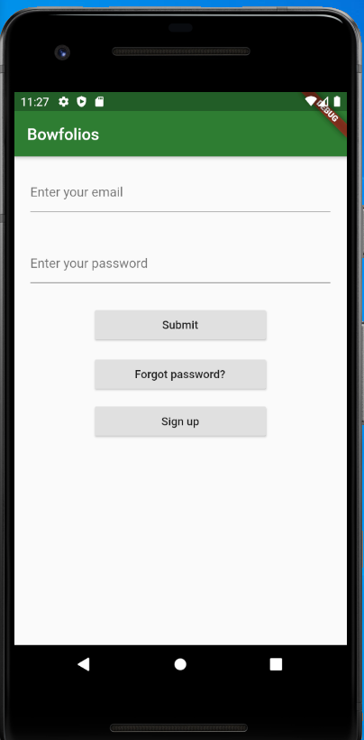
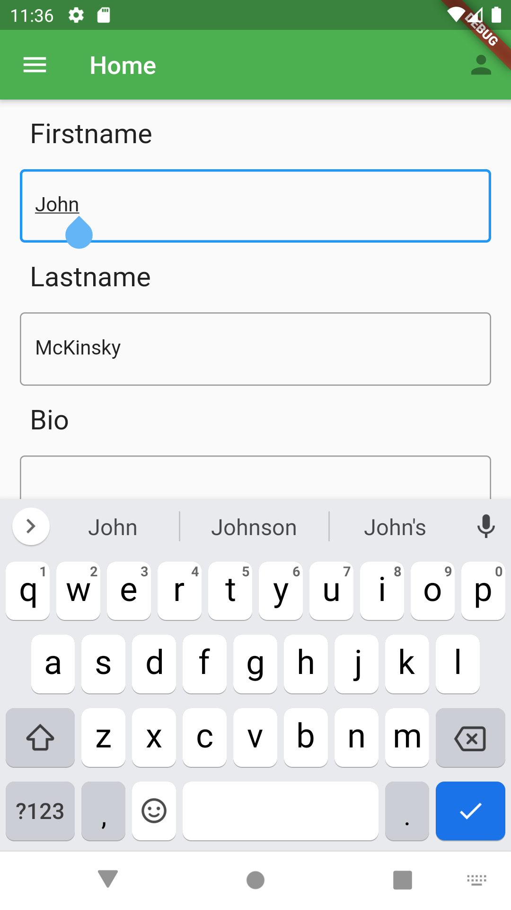
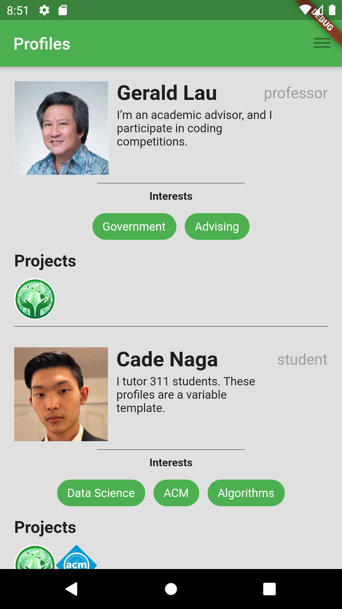
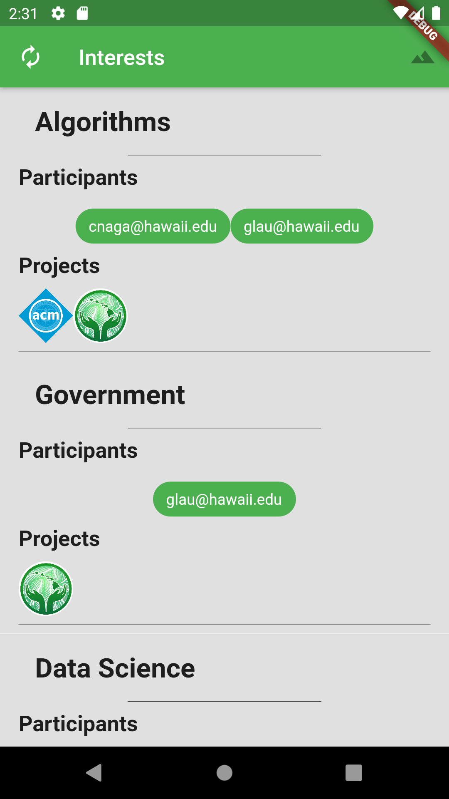
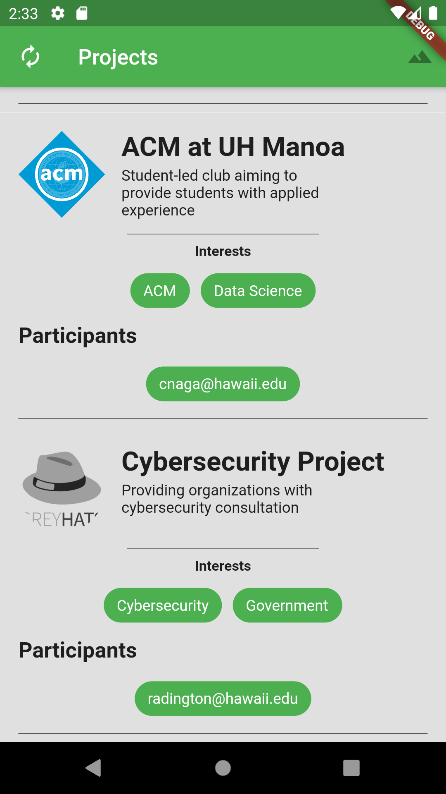
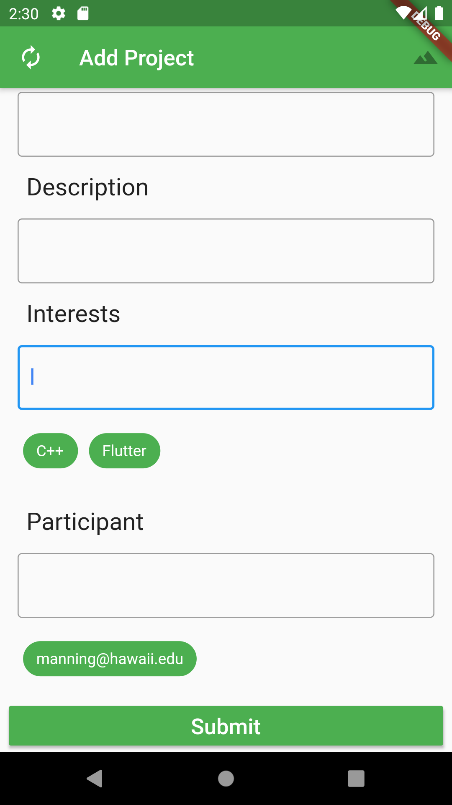
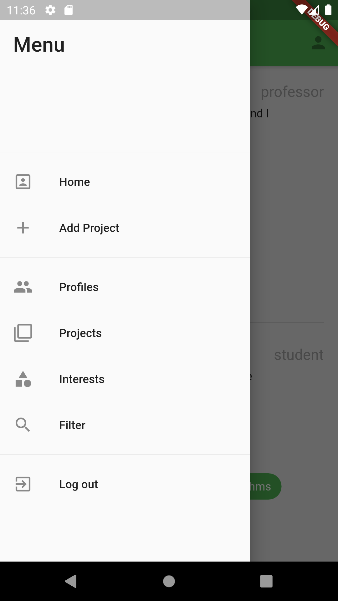
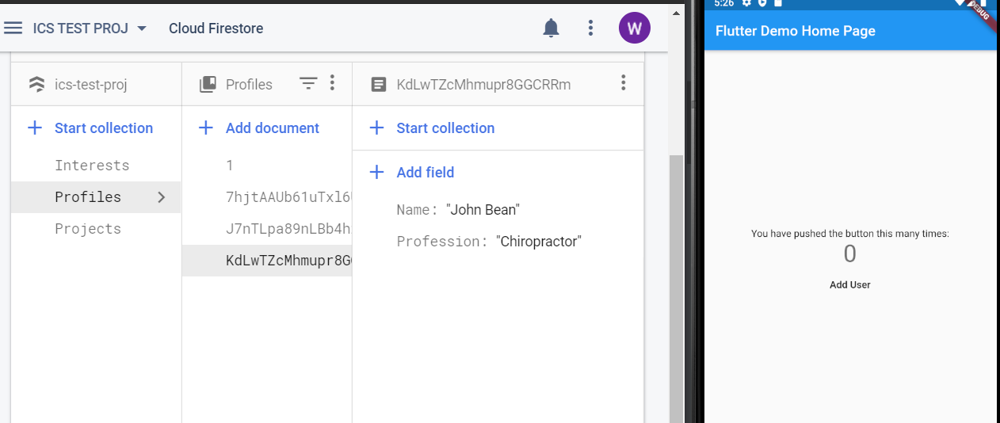

# Bowfolios

## Milestone 1
- Create repository
- Add profiles page
- Setup Firebase

## Milestone 2
- Add menu and navigation.
- Add page routing
- Add home page
- Reconfigure Firebase
- Log in and user session

## Milestone 3
- Add projects page
- Add interests page
- Add add-project page
- Log out button

## Summary
This project is built using Flutter and Firebase. This application is designed for android, but it can be easily ported to IOS or other mobile OS. Users can login into the app and access the I.C.S. projects, interests, and profiles on the database.

## Functionality

These are the pages implemented in the app.

### Login Page

### Home Page

### Profiles Page

### Interests Page

### Projects Page

### Add Project Page

(Unfortunately, added projects will have limited reflection on the add project page!)

Users can navigate the app using the menu.

Additionally, the app is linked to the Firebase backend upon start up.

### Firebase

Firebase is the database solution for this project.

## Installation

### 1. Download Bowfolios at https://github.com/ElectricRat/SigmaAlphaSierra/

### 2. Download Android Studio at https://developer.android.com/studio

### 3. Download Flutter at https://flutter.dev/docs/get-started/install

### 4. Install the Android Studio and Flutter tools

When installing Flutter, take note of the directory it is installed to.

### 5. Set up Android Studio to run Bowfolios

 - in Android Studio, select "open existing project" and choose the top-level Bowfolios directory. ("SigmaAlphaSierra")
 - When the project opens, select file > settings > plugins, find "Flutter" on the list, and click "install". When prompted, restart the IDE.
 - Select file > settings > Languages and Frameworks > Flutter. In the empty "Flutter SDK Path" field, enter the directory in which you installed Flutter.
 - Select lib > Main.dart from the project navigation window. On the on-screen prompt, select "get dependencies", or run "flutter pub get" from the command line.
 - Select the AVD manager icon (top right - little phone with Android logo) to open the AVD manager. Click "add new device", "pixel 2", and "pie (API 28)". Wait for the pixel 2 device and pie API to download.
 - Select the installed Android Virtual Device on the taskbar in Android Studio
 - Run the application with the "run" icon (play button) on the taskbar in Android Studio

### 6. Run Bowfolios

Before running bowfolios, make sure to run `flutter pub get` to install all
of the dependencies.

To access bowfolios app, run main.dart on an emulated device. At the curret state,
the app has two disconnected pages: login and profiles.
